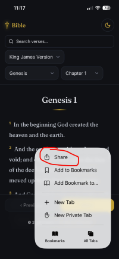
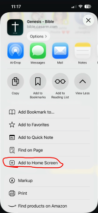
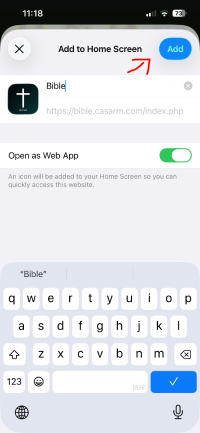

# Bible Web App
View project here : https://bible.casarm.com/

I was tired of the complex Bible apps out there, many of which are filled with ads, so I decided to create my own simple and distraction-free Bible app.

It currently features:

- **King James Version (KJV)**
- **Louis Segond 1910**
- **Martin** for French compatibility

## Installation

The web app can be installed on all devices.

### iOS

On iOS devices, open the website in **Safari**, tap the **Share** button, then select **Add to Home Screen** to install it as an app.

### Other Devices

On supported browsers, use the **Install App** button provided by the website to install the web app.
